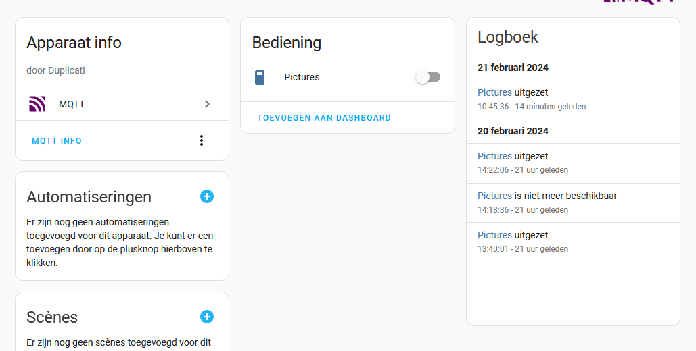

duplicati-nodered-homeassistant
===============================
### Configuration
Expose duplicati to homeassistant via nodered/mqtt.
You need to have a working mqtt broker, homeassistant configured correctly to work with this broker and accept discovery of new devices.

Configuration should be done by a yaml file. In the current flow, this file is to be stored on /data/duplicati/duplicati_config.yaml

```
nodered:$ pwd
/data/duplicati

nodered:$ cat duplicati_config.yaml
duplicatiservers:
  - IP: "192.168.0.1"
    port: 8200
    password: ui-password
    mode: "kestrel"
  - IP: "192.168.0.2"
    port: 8200
    mode: "legacy"
mqtt:
  broker: 192.168.0.3
  port: 1883
  username: mosquitto
  password: mosquitto
```

### Backup Device in Home Assistant
If configured correctly, your backup from Duplicati will appear as a new device in Home Asssitant. You can start a backup by toggling the switch. Attributes of the switch contains other backup information.


### Remarks 
* When a backup is ongoing, updates will be send over to mqtt every 20 seconds.
* Stopping an ongoing backup is not currently supported.
* If you toggle the Backup Active-switch, it will put the backup in the queue. If the queue is empty, it will start immediately; otherwise it will be queued.
